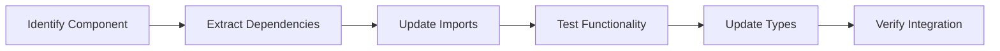

# SISO Migration Playbook

**🛠️ Practical Implementation Guide**  
**⏱️ Timeline:** 2 Days (16 hours)  
**👥 Team:** 3-4 developers  
**📖 Reading Time:** 15 minutes  

## 🚀 Migration Strategy

### Overall Approach
**Monolithic → Modular Monorepo Transformation**

```
SISO-CLIENT-BASE (400+ components, single app)
         ↓
SISO-PUBLIC (modular workspace)
├── apps/admin-dashboard
├── apps/client-portal  
├── apps/partner-hub
├── apps/marketing-site
└── packages/ui (shared components)
```

### Component Migration Priority Matrix

| Priority | Components | Complexity | Risk | Business Impact |
|----------|------------|------------|------|-----------------|
| **🔴 CRITICAL** | UI Package (200+) | Medium | Low | High |
| **🟡 HIGH** | Admin App (100+) | High | Medium | Critical |
| **🟠 MEDIUM** | Client App (60+) | Medium | Low | High |
| **🟢 LOW** | Partner/Marketing | Low | Low | Medium |

## 📋 Day 1: Foundation Setup (8 hours)

### Hour 1-2: Environment Setup
```bash
# 1. Navigate to target directory
cd /Users/shaansisodia/DEV/SISO-ECOSYSTEM/SISO-PUBLIC

# 2. Initialize monorepo (choose one)
# Option A: Nx (Recommended for enterprise)
npx create-nx-workspace@latest siso-enterprise \
  --preset=react-monorepo \
  --bundler=vite \
  --style=tailwind \
  --packageManager=npm

# Option B: Turbo (Alternative)
npx create-turbo@latest siso-enterprise

# 3. Setup workspace structure
mkdir -p apps/{admin-dashboard,client-portal,partner-hub,marketing-site}
mkdir -p packages/{ui,auth,api,utils,config,types}
mkdir -p tools/{eslint-config,typescript-config}
```

**✅ Checkpoint:** Monorepo structure created and building

### Hour 3-4: UI Package Creation
```bash
# Create shared UI package
cd packages/ui
npm init -y

# Package.json setup
{
  "name": "@siso/ui",
  "version": "1.0.0",
  "main": "./dist/index.js",
  "types": "./dist/index.d.ts",
  "exports": {
    ".": {
      "types": "./dist/index.d.ts",
      "import": "./dist/index.js"
    }
  }
}
```

**Migration Components (Priority Order):**
1. **Tier 1 (Hour 3):** Basic UI components (Button, Input, Card, etc.)
2. **Tier 2 (Hour 4):** Complex components (DataTable, Forms, Modals, etc.)

```typescript
// UI package structure
packages/ui/
├── src/
│   ├── components/
│   │   ├── basic/          // Button, Input, Card
│   │   ├── forms/          // FormField, FormWrapper
│   │   ├── data/           // DataTable, Charts
│   │   ├── layout/         // Header, Sidebar, Layout
│   │   └── feedback/       // Toast, Modal, Alert
│   ├── hooks/              // Custom React hooks
│   ├── utils/              // Component utilities
│   └── types/              // Component prop types
├── tsconfig.json
└── package.json
```

**✅ Checkpoint:** UI package with 50+ core components migrated

### Hour 5-6: Authentication Package
```bash
# Create auth package
cd packages/auth
npm init -y
```

**Critical Auth Components:**
- User types and roles (Admin/Client/Partner)
- Authentication hooks
- Route protection
- Supabase integration
- Session management

```typescript
// Auth package structure
packages/auth/
├── src/
│   ├── types/              // User, Role, Session types
│   ├── hooks/              // useAuth, useUser, useRole
│   ├── components/         // ProtectedRoute, AuthProvider
│   ├── utils/              // Auth helpers
│   └── supabase/           // Supabase client config
└── package.json
```

**✅ Checkpoint:** Authentication system working across packages

### Hour 7-8: Build Pipeline & Testing
```bash
# Setup build pipeline
npm install -D @types/react @types/node
npm install -D typescript vite @vitejs/plugin-react
npm install -D @testing-library/react @testing-library/jest-dom
npm install -D playwright @playwright/test

# Configure workspace build
npm run build        # Build all packages
npm run test         # Run all tests
npm run lint         # Lint all code
```

**Testing Strategy:**
- Unit tests for UI components
- Integration tests for auth flow
- E2E tests for critical paths

**✅ End of Day 1:** Foundation complete, shared packages working

---

## 📋 Day 2: Application Migration (8 hours)

### Hour 1-3: Admin Dashboard Migration

**Why First:** Most complex, highest business value, largest component count

```bash
# Create admin app
cd apps/admin-dashboard
npm init -y

# Install dependencies
npm install react react-dom @siso/ui @siso/auth
npm install @tanstack/react-query jotai
npm install @supabase/supabase-js
```

**Migration Process:**
1. **Core Layout** (30 min): Header, Sidebar, Main content area
2. **Dashboard Pages** (90 min): Analytics, Overview, Reports
3. **Management Pages** (60 min): Clients, Projects, Tasks, Payments

**Critical Admin Features:**
- Client management system
- Project tracking dashboard
- Financial analytics
- User role management
- System administration

```typescript
// Admin app structure
apps/admin-dashboard/
├── src/
│   ├── pages/              // Route-based pages
│   ├── components/         // App-specific components
│   ├── hooks/              // Admin-specific hooks
│   ├── utils/              // Business logic
│   └── routes/             // Routing configuration
├── public/
├── index.html
└── vite.config.ts
```

**✅ Checkpoint:** Admin dashboard fully functional

### Hour 4-5: Client Portal Migration

**Focus:** Customer-facing interface with project management

```bash
# Create client app
cd apps/client-portal
npm init -y
npm install react react-dom @siso/ui @siso/auth
```

**Key Client Features:**
- Project status dashboard
- Document management
- Communication center
- Invoice and payment tracking
- Support ticket system

**Migration Order:**
1. Dashboard/overview pages
2. Project management interface
3. Document upload/viewing
4. Communication features

**✅ Checkpoint:** Client portal operational

### Hour 6: Partner Hub Migration

**Focus:** Partner/referral management system

```bash
# Create partner app
cd apps/partner-hub
npm init -y
npm install react react-dom @siso/ui @siso/auth
```

**Key Partner Features:**
- Training materials and resources
- Referral tracking and leaderboards
- Commission management
- Performance analytics
- Marketing materials access

**✅ Checkpoint:** Partner hub functional

### Hour 7: Marketing Site Migration

**Focus:** Public-facing marketing and lead generation

```bash
# Create marketing app
cd apps/marketing-site
npm init -y
npm install react react-dom @siso/ui
```

**Key Marketing Features:**
- Industry-specific landing pages (30+)
- Lead capture forms
- Service descriptions
- Contact and pricing pages
- SEO optimization

**✅ Checkpoint:** Marketing site live

### Hour 8: Final Testing & Deployment

**Comprehensive Testing Checklist:**
- [ ] All applications build successfully
- [ ] Authentication works across all apps
- [ ] Shared components render correctly
- [ ] Critical user flows functional
- [ ] Performance targets met
- [ ] No console errors or warnings

**Deployment Verification:**
```bash
# Build all apps
npm run build

# Test all apps locally
npm run dev:admin    # http://localhost:3001
npm run dev:client   # http://localhost:3002  
npm run dev:partner  # http://localhost:3003
npm run dev:marketing # http://localhost:3004
```

**✅ End of Day 2:** Complete migration successful

---

## 🔄 Migration Process Details

### Component Migration Workflow



### Step-by-Step Component Migration

1. **Identify Component**
   ```bash
   # Find component in SISO-CLIENT-BASE
   find . -name "*ComponentName*" -type f
   ```

2. **Extract to Package**
   ```bash
   # Copy to appropriate package
   cp components/ComponentName packages/ui/src/components/
   ```

3. **Update Imports**
   ```typescript
   // Old import
   import { Button } from '../components/ui/button'
   
   // New import  
   import { Button } from '@siso/ui'
   ```

4. **Update Package Exports**
   ```typescript
   // packages/ui/src/index.ts
   export { Button } from './components/basic/button'
   export { DataTable } from './components/data/data-table'
   ```

### Quality Gates

**Before Moving to Next Phase:**
- [ ] All tests passing
- [ ] No TypeScript errors
- [ ] Performance benchmarks met
- [ ] Code review completed
- [ ] Documentation updated

## 📊 Success Metrics Tracking

### Real-time Monitoring

**Performance Metrics:**
```bash
# Bundle size analysis
npm run analyze

# Build time tracking
time npm run build

# Test coverage
npm run test:coverage
```

**Target Metrics:**
- Bundle size: <500KB per app
- Build time: <30 seconds
- Test coverage: >85%
- Type coverage: 100%

### Quality Assurance

**Critical Path Testing:**
1. User authentication flow
2. Admin dashboard navigation
3. Client project management
4. Partner commission tracking
5. Marketing lead capture

## 🚨 Troubleshooting Guide

### Common Issues

**Build Failures:**
```bash
# Clear all node_modules and reinstall
rm -rf node_modules packages/*/node_modules apps/*/node_modules
npm install
```

**Import Resolution Issues:**
```json
// tsconfig.json - Add path mapping
{
  "compilerOptions": {
    "paths": {
      "@siso/ui": ["./packages/ui/src"],
      "@siso/auth": ["./packages/auth/src"]
    }
  }
}
```

**Performance Issues:**
```bash
# Analyze bundle sizes
npm run build:analyze

# Profile build performance
npm run build:profile
```

### Rollback Strategy

**If Critical Issues Arise:**
1. **Immediate:** Revert to tagged backup
2. **Incremental:** Roll back specific component
3. **Gradual:** Migrate back to monolith temporarily

```bash
# Emergency rollback
git checkout backup-tag
npm install
npm run dev
```

## 🎯 Post-Migration Checklist

### Immediate Validation
- [ ] All applications accessible
- [ ] User authentication working
- [ ] Core business functions operational
- [ ] Performance targets achieved
- [ ] No data loss or corruption

### Team Enablement
- [ ] Development team trained on new structure
- [ ] Documentation updated
- [ ] CI/CD pipeline updated
- [ ] Monitoring and alerting configured

### Business Continuity
- [ ] Customer-facing features verified
- [ ] Administrative functions tested
- [ ] Partner systems operational
- [ ] Marketing site functional

---

**🎯 Mission Complete:** SISO successfully transformed into modern, scalable architecture.  
**📈 Next Phase:** Performance optimization and feature enhancement.

**📞 Support:** For issues during migration, refer to [Technical Reference](./SISO-TECHNICAL-REFERENCE.md)