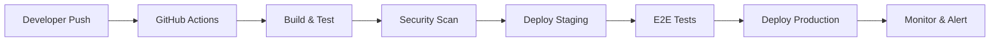

# Deployment & CI/CD Pipeline Setup
*SISO Unified Platform Production Infrastructure*

## 🚀 Complete CI/CD Pipeline Architecture

### **Pipeline Overview**


**Environments:**
- **Development**: Local development with Supabase local
- **Staging**: Pre-production testing environment  
- **Production**: Live platform for users

---

## 📋 GitHub Actions Workflow

### **.github/workflows/deploy.yml**
```yaml
name: Deploy SISO Unified Platform

on:
  push:
    branches: [main, develop]
  pull_request:
    branches: [main]

env:
  NODE_VERSION: '18.16.0'
  
jobs:
  # Job 1: Build and Test
  build-and-test:
    name: Build and Test
    runs-on: ubuntu-latest
    
    steps:
      - name: Checkout code
        uses: actions/checkout@v4
        
      - name: Setup Node.js
        uses: actions/setup-node@v4
        with:
          node-version: ${{ env.NODE_VERSION }}
          cache: 'npm'
          
      - name: Install dependencies
        run: npm ci
        
      - name: Type check
        run: npm run type-check
        
      - name: Lint code
        run: npm run lint
        
      - name: Run unit tests
        run: npm run test:unit
        
      - name: Build application
        run: npm run build
        env:
          VITE_SUPABASE_URL: ${{ secrets.STAGING_SUPABASE_URL }}
          VITE_SUPABASE_ANON_KEY: ${{ secrets.STAGING_SUPABASE_ANON_KEY }}
          
      - name: Upload build artifacts
        uses: actions/upload-artifact@v4
        with:
          name: build-files
          path: dist/
          retention-days: 1

  # Job 2: Security Scanning
  security-scan:
    name: Security Scan
    runs-on: ubuntu-latest
    needs: build-and-test
    
    steps:
      - name: Checkout code
        uses: actions/checkout@v4
        
      - name: Run npm audit
        run: npm audit --audit-level=moderate
        
      - name: Run Snyk security scan
        uses: snyk/actions/node@master
        env:
          SNYK_TOKEN: ${{ secrets.SNYK_TOKEN }}
        with:
          args: --severity-threshold=high
          
      - name: CodeQL Analysis
        uses: github/codeql-action/analyze@v3
        with:
          languages: javascript

  # Job 3: Deploy to Staging
  deploy-staging:
    name: Deploy to Staging
    runs-on: ubuntu-latest
    needs: [build-and-test, security-scan]
    if: github.ref == 'refs/heads/develop'
    
    environment:
      name: staging
      url: https://staging.siso-platform.com
      
    steps:
      - name: Checkout code
        uses: actions/checkout@v4
        
      - name: Download build artifacts
        uses: actions/download-artifact@v4
        with:
          name: build-files
          path: dist/
          
      - name: Deploy to Vercel Staging
        uses: amondnet/vercel-action@v25
        with:
          vercel-token: ${{ secrets.VERCEL_TOKEN }}
          vercel-org-id: ${{ secrets.VERCEL_ORG_ID }}
          vercel-project-id: ${{ secrets.VERCEL_PROJECT_ID }}
          vercel-args: '--prod=false'
          working-directory: ./
          
      - name: Update Supabase Staging
        run: |
          npx supabase login --token ${{ secrets.SUPABASE_ACCESS_TOKEN }}
          npx supabase link --project-ref ${{ secrets.STAGING_SUPABASE_REF }}
          npx supabase db push --include-seed
          
      - name: Notify Slack - Staging Deployed
        uses: 8398a7/action-slack@v3
        with:
          status: success
          channel: '#deployments'
          text: '🚀 Staging deployment successful: https://staging.siso-platform.com'
        env:
          SLACK_WEBHOOK_URL: ${{ secrets.SLACK_WEBHOOK_URL }}

  # Job 4: End-to-End Testing
  e2e-testing:
    name: E2E Testing
    runs-on: ubuntu-latest
    needs: deploy-staging
    if: github.ref == 'refs/heads/develop'
    
    steps:
      - name: Checkout code
        uses: actions/checkout@v4
        
      - name: Setup Node.js
        uses: actions/setup-node@v4
        with:
          node-version: ${{ env.NODE_VERSION }}
          cache: 'npm'
          
      - name: Install dependencies
        run: npm ci
        
      - name: Install Playwright
        run: npx playwright install --with-deps
        
      - name: Run E2E tests against staging
        run: npm run test:e2e
        env:
          BASE_URL: https://staging.siso-platform.com
          TEST_USER_EMAIL: ${{ secrets.TEST_USER_EMAIL }}
          TEST_USER_PASSWORD: ${{ secrets.TEST_USER_PASSWORD }}
          
      - name: Upload E2E test results
        uses: actions/upload-artifact@v4
        if: failure()
        with:
          name: e2e-test-results
          path: test-results/
          retention-days: 7

  # Job 5: Deploy to Production
  deploy-production:
    name: Deploy to Production
    runs-on: ubuntu-latest
    needs: [e2e-testing]
    if: github.ref == 'refs/heads/main'
    
    environment:
      name: production
      url: https://platform.siso.com
      
    steps:
      - name: Checkout code
        uses: actions/checkout@v4
        
      - name: Setup Node.js
        uses: actions/setup-node@v4
        with:
          node-version: ${{ env.NODE_VERSION }}
          cache: 'npm'
          
      - name: Install dependencies
        run: npm ci
        
      - name: Build for production
        run: npm run build
        env:
          VITE_SUPABASE_URL: ${{ secrets.PROD_SUPABASE_URL }}
          VITE_SUPABASE_ANON_KEY: ${{ secrets.PROD_SUPABASE_ANON_KEY }}
          VITE_APP_ENV: production
          
      - name: Deploy to Vercel Production
        uses: amondnet/vercel-action@v25
        with:
          vercel-token: ${{ secrets.VERCEL_TOKEN }}
          vercel-org-id: ${{ secrets.VERCEL_ORG_ID }}
          vercel-project-id: ${{ secrets.VERCEL_PROJECT_ID }}
          vercel-args: '--prod'
          working-directory: ./
          
      - name: Update Supabase Production
        run: |
          npx supabase login --token ${{ secrets.SUPABASE_ACCESS_TOKEN }}
          npx supabase link --project-ref ${{ secrets.PROD_SUPABASE_REF }}
          npx supabase db push
          
      - name: Run production smoke tests
        run: npm run test:smoke
        env:
          BASE_URL: https://platform.siso.com
          
      - name: Notify team - Production deployed
        uses: 8398a7/action-slack@v3
        with:
          status: success
          channel: '#general'
          text: '🎉 Production deployment successful! https://platform.siso.com'
        env:
          SLACK_WEBHOOK_URL: ${{ secrets.SLACK_WEBHOOK_URL }}

  # Job 6: Post-deployment monitoring
  post-deployment:
    name: Post-deployment Monitoring
    runs-on: ubuntu-latest
    needs: deploy-production
    if: github.ref == 'refs/heads/main'
    
    steps:
      - name: Trigger uptime monitoring
        run: |
          curl -X POST "${{ secrets.UPTIME_WEBHOOK_URL }}" \
            -H "Content-Type: application/json" \
            -d '{"event": "deployment", "environment": "production", "version": "${{ github.sha }}"}'
            
      - name: Update status page
        run: |
          curl -X POST "${{ secrets.STATUS_PAGE_API }}" \
            -H "Authorization: Bearer ${{ secrets.STATUS_PAGE_TOKEN }}" \
            -H "Content-Type: application/json" \
            -d '{"message": "Platform updated successfully", "status": "operational"}'
```

---

## 🔧 Vercel Configuration

### **vercel.json**
```json
{
  "version": 2,
  "framework": "vite",
  "buildCommand": "npm run build",
  "outputDirectory": "dist",
  "installCommand": "npm ci",
  "devCommand": "npm run dev",
  "cleanUrls": true,
  "trailingSlash": false,
  
  "env": {
    "VITE_APP_VERSION": "$VERCEL_GIT_COMMIT_SHA"
  },
  
  "build": {
    "env": {
      "VITE_SUPABASE_URL": "@supabase_url",
      "VITE_SUPABASE_ANON_KEY": "@supabase_anon_key",
      "VITE_APP_ENV": "@app_environment"
    }
  },
  
  "functions": {
    "app/api/**/*.ts": {
      "runtime": "@vercel/node",
      "maxDuration": 30
    }
  },
  
  "headers": [
    {
      "source": "/(.*)",
      "headers": [
        {
          "key": "X-Frame-Options",
          "value": "DENY"
        },
        {
          "key": "X-Content-Type-Options",
          "value": "nosniff"
        },
        {
          "key": "Referrer-Policy",
          "value": "strict-origin-when-cross-origin"
        },
        {
          "key": "Permissions-Policy",
          "value": "camera=(), microphone=(), geolocation=()"
        }
      ]
    },
    {
      "source": "/static/(.*)",
      "headers": [
        {
          "key": "Cache-Control",
          "value": "public, max-age=31536000, immutable"
        }
      ]
    }
  ],
  
  "redirects": [
    {
      "source": "/login",
      "destination": "/auth/login",
      "permanent": false
    },
    {
      "source": "/register",
      "destination": "/auth/register", 
      "permanent": false
    }
  ],
  
  "rewrites": [
    {
      "source": "/api/(.*)",
      "destination": "/api/$1"
    }
  ]
}
```

### **Environment Variables Setup**
```bash
# Production Environment Variables (Vercel)
vercel env add VITE_SUPABASE_URL production
vercel env add VITE_SUPABASE_ANON_KEY production
vercel env add VITE_APP_ENV production

# Staging Environment Variables
vercel env add VITE_SUPABASE_URL preview
vercel env add VITE_SUPABASE_ANON_KEY preview
vercel env add VITE_APP_ENV preview

# Development Environment Variables
vercel env add VITE_SUPABASE_URL development
vercel env add VITE_SUPABASE_ANON_KEY development
vercel env add VITE_APP_ENV development
```

---

## 🐳 Docker Configuration (Optional)

### **Dockerfile**
```dockerfile
# Multi-stage build for production optimization
FROM node:18-alpine as build

WORKDIR /app

# Copy package files
COPY package*.json ./
RUN npm ci --only=production && npm cache clean --force

# Copy source code
COPY . .

# Build application
RUN npm run build

# Production image
FROM nginx:alpine

# Copy built files
COPY --from=build /app/dist /usr/share/nginx/html

# Copy nginx configuration
COPY nginx.conf /etc/nginx/nginx.conf

# Expose port
EXPOSE 80

# Health check
HEALTHCHECK --interval=30s --timeout=3s --start-period=5s --retries=3 \
  CMD curl -f http://localhost/ || exit 1

CMD ["nginx", "-g", "daemon off;"]
```

### **docker-compose.yml (Development)**
```yaml
version: '3.8'

services:
  app:
    build: .
    ports:
      - "3000:80"
    environment:
      - VITE_SUPABASE_URL=${VITE_SUPABASE_URL}
      - VITE_SUPABASE_ANON_KEY=${VITE_SUPABASE_ANON_KEY}
    volumes:
      - ./nginx.conf:/etc/nginx/nginx.conf:ro
    depends_on:
      - supabase
      
  supabase:
    image: supabase/supabase:latest
    ports:
      - "54321:8000"
    environment:
      - POSTGRES_PASSWORD=postgres
    volumes:
      - supabase_data:/var/lib/postgresql/data

volumes:
  supabase_data:
```

---

## 📊 Monitoring & Alerting

### **Health Check Endpoints**
```typescript
// app/api/health/route.ts
export async function GET() {
  try {
    // Check database connection
    const { data, error } = await supabase
      .from('users')
      .select('count')
      .limit(1);
      
    if (error) throw error;
    
    return Response.json({
      status: 'healthy',
      timestamp: new Date().toISOString(),
      version: process.env.VITE_APP_VERSION,
      database: 'connected',
      uptime: process.uptime()
    });
  } catch (error) {
    return Response.json({
      status: 'unhealthy',
      error: error.message
    }, { status: 500 });
  }
}
```

### **Uptime Monitoring Script**
```bash
#!/bin/bash
# scripts/health-check.sh

ENDPOINTS=(
  "https://platform.siso.com/api/health"
  "https://staging.siso-platform.com/api/health"
)

SLACK_WEBHOOK_URL="${SLACK_WEBHOOK_URL}"

for endpoint in "${ENDPOINTS[@]}"; do
  response=$(curl -s -w "%{http_code}" "$endpoint")
  http_code="${response: -3}"
  
  if [[ "$http_code" != "200" ]]; then
    # Send alert to Slack
    curl -X POST "$SLACK_WEBHOOK_URL" \
      -H 'Content-type: application/json' \
      --data "{
        \"text\": \"🚨 Health check failed for $endpoint\",
        \"attachments\": [{
          \"color\": \"danger\",
          \"fields\": [{
            \"title\": \"HTTP Status\",
            \"value\": \"$http_code\",
            \"short\": true
          }, {
            \"title\": \"Endpoint\",
            \"value\": \"$endpoint\",
            \"short\": true
          }]
        }]
      }"
  fi
done
```

### **Performance Monitoring**
```typescript
// utils/performance.ts
export const performanceMonitor = {
  // Track Core Web Vitals
  trackWebVitals() {
    import('web-vitals').then(({ getCLS, getFID, getFCP, getLCP, getTTFB }) => {
      getCLS(this.sendToAnalytics);
      getFID(this.sendToAnalytics);
      getFCP(this.sendToAnalytics);
      getLCP(this.sendToAnalytics);
      getTTFB(this.sendToAnalytics);
    });
  },
  
  // Send metrics to monitoring service
  sendToAnalytics(metric: any) {
    if (process.env.NODE_ENV === 'production') {
      // Send to your analytics service
      fetch('/api/analytics', {
        method: 'POST',
        body: JSON.stringify({
          name: metric.name,
          value: metric.value,
          id: metric.id,
          timestamp: Date.now()
        })
      });
    }
  },
  
  // Track real-time connection health
  trackRealtimeHealth() {
    const startTime = Date.now();
    
    supabase.realtime.channels[0].socket.onOpen = () => {
      const connectionTime = Date.now() - startTime;
      this.sendToAnalytics({
        name: 'realtime_connection_time',
        value: connectionTime,
        id: 'realtime'
      });
    };
  }
};
```

---

## 🔐 Security Configuration

### **Content Security Policy**
```typescript
// middleware.ts
import { NextRequest, NextResponse } from 'next/server';

export function middleware(request: NextRequest) {
  const response = NextResponse.next();
  
  // Content Security Policy
  const csp = [
    "default-src 'self'",
    "script-src 'self' 'unsafe-eval' 'unsafe-inline' https://cdn.jsdelivr.net",
    "style-src 'self' 'unsafe-inline' https://fonts.googleapis.com",
    "font-src 'self' https://fonts.gstatic.com",
    "img-src 'self' data: https: blob:",
    "connect-src 'self' https://*.supabase.co wss://*.supabase.co",
    "media-src 'self' blob:",
    "worker-src 'self' blob:",
    "frame-ancestors 'none'",
    "base-uri 'self'",
    "form-action 'self'"
  ].join('; ');
  
  response.headers.set('Content-Security-Policy', csp);
  response.headers.set('X-Frame-Options', 'DENY');
  response.headers.set('X-Content-Type-Options', 'nosniff');
  response.headers.set('Referrer-Policy', 'strict-origin-when-cross-origin');
  
  return response;
}

export const config = {
  matcher: [
    '/((?!api|_next/static|_next/image|favicon.ico).*)',
  ],
};
```

### **Environment Secrets Management**
```bash
# Required GitHub Secrets
VERCEL_TOKEN=your_vercel_token
VERCEL_ORG_ID=your_org_id
VERCEL_PROJECT_ID=your_project_id

# Supabase Secrets
SUPABASE_ACCESS_TOKEN=your_supabase_token
STAGING_SUPABASE_REF=your_staging_ref
PROD_SUPABASE_REF=your_production_ref
STAGING_SUPABASE_URL=https://staging.supabase.co
STAGING_SUPABASE_ANON_KEY=your_staging_key
PROD_SUPABASE_URL=https://production.supabase.co
PROD_SUPABASE_ANON_KEY=your_production_key

# Monitoring & Alerts
SLACK_WEBHOOK_URL=your_slack_webhook
UPTIME_WEBHOOK_URL=your_uptime_service
STATUS_PAGE_API=your_status_page_api
STATUS_PAGE_TOKEN=your_status_token

# Security Scanning
SNYK_TOKEN=your_snyk_token

# Testing
TEST_USER_EMAIL=test@example.com
TEST_USER_PASSWORD=test_password_123
```

---

## 🚦 Deployment Checklist

### **Pre-deployment Checklist**
- [ ] **Code Quality**
  - [ ] All tests passing (unit, integration, E2E)
  - [ ] Code coverage >90% for critical paths
  - [ ] TypeScript type checking passes
  - [ ] ESLint warnings resolved
  - [ ] Security scan passes

- [ ] **Environment Setup**
  - [ ] Environment variables configured
  - [ ] Database migrations tested
  - [ ] Staging environment mirrors production
  - [ ] SSL certificates valid
  - [ ] CDN configuration optimized

- [ ] **Performance**
  - [ ] Bundle size under 500KB gzipped
  - [ ] Lighthouse score >90 for all metrics
  - [ ] Real-time latency tested
  - [ ] Database queries optimized
  - [ ] Caching strategy implemented

### **Post-deployment Checklist**
- [ ] **Verification**
  - [ ] Health checks passing
  - [ ] Authentication flow working
  - [ ] Real-time messaging functional
  - [ ] Mobile responsiveness verified
  - [ ] Core user journeys tested

- [ ] **Monitoring**
  - [ ] Error monitoring active
  - [ ] Performance tracking enabled
  - [ ] Uptime monitoring configured
  - [ ] Alert notifications working
  - [ ] Status page updated

### **Rollback Plan**
```bash
# Emergency rollback procedure
# 1. Rollback Vercel deployment
vercel rollback https://platform.siso.com --token $VERCEL_TOKEN

# 2. Rollback database if needed
supabase db reset --db-url $BACKUP_DB_URL

# 3. Notify team
curl -X POST $SLACK_WEBHOOK_URL \
  -H 'Content-type: application/json' \
  --data '{"text": "🔄 Emergency rollback completed"}'
```

---

## 📈 Performance Optimization

### **Build Optimization**
```typescript
// vite.config.ts
export default defineConfig({
  build: {
    rollupOptions: {
      output: {
        manualChunks: {
          vendor: ['react', 'react-dom'],
          ui: ['@headlessui/react', 'framer-motion'],
          supabase: ['@supabase/supabase-js'],
          utils: ['date-fns', 'lodash']
        }
      }
    },
    chunkSizeWarningLimit: 1000
  },
  
  server: {
    compression: true
  }
});
```

### **CDN Configuration**
```javascript
// Cache strategy for static assets
const cacheConfig = {
  // Long-term caching for versioned assets
  '/static/**': {
    'Cache-Control': 'public, max-age=31536000, immutable'
  },
  
  // Short-term caching for HTML
  '/**/*.html': {
    'Cache-Control': 'public, max-age=300'
  },
  
  // API responses
  '/api/**': {
    'Cache-Control': 'no-cache, no-store, must-revalidate'
  }
};
```

---

*Deployment Success = Automated pipeline + comprehensive monitoring + rapid rollback capability*