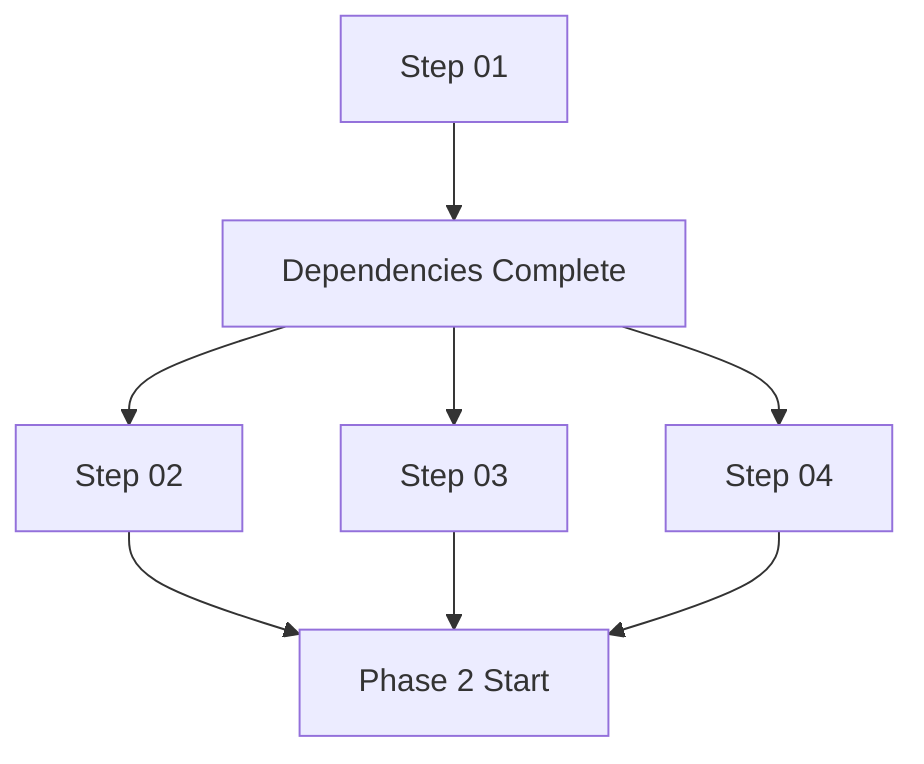

# PDR Cookbook Execution Guide

## 🚀 Quick Start for AI Agents

### Initialize New Project
```bash
# 1. Copy cookbook to new project
cp -r PDR-cookbook/ CLIENT_NAME/

# 2. Create project structure
cd CLIENT_NAME
mkdir -p client-input PDR/{01-discovery,02-planning,03-design,04-technical,05-implementation}

# 3. Start with client input
# Place raw client information in: client-input/raw-input.txt
```

### Execution Command
```
TASK: Create comprehensive PDR for [CLIENT_NAME]
INPUT: client-input/raw-input.txt
COOKBOOK: Follow PDR-cookbook steps 01-15
MODE: Autonomous with parallel agents
OUTPUT: Complete PDR in standardized format
```

## 📋 Step-by-Step Execution

### Phase 1: Discovery (2-3 hours)

#### Single Agent Flow:
1. **Step 01**: Parse client requirements → structured JSON
2. **Step 02**: Market research → industry insights
3. **Step 03**: Competitor analysis → feature matrix
4. **Step 04**: Technical research → stack recommendations

#### Parallel Agent Flow:
```
Agent 1: Step 01 (Client requirements)
Wait for completion...
Then split:
- Agent 2: Step 02 (Market research)
- Agent 3: Step 03 (Competitor analysis)
- Agent 4: Step 04 (Technical research)
```

### Phase 2: Planning (2-3 hours)

#### Tasks:
5. **Step 05**: Feature roadmap (versions 0.1 to 3.0)
6. **Step 06**: Site architecture & navigation
7. **Step 07**: Page wireframes & layouts
8. **Step 08**: UI component library
9. **Step 09**: Branding & design system

#### Parallel Opportunity:
- Wireframes and component library can be done simultaneously
- Branding can start once competitors are analyzed

### Phase 3: Technical (1-2 hours)

#### Tasks:
10. **Step 10**: Database schema design
11. **Step 11**: API planning & integrations
12. **Step 12**: Technical architecture decisions
13. **Step 13**: Security & compliance requirements

#### Dependencies:
- Database design needs feature list from Step 05
- API planning requires technical research from Step 04

### Phase 4: Implementation (1-2 hours)

#### Tasks:
14. **Step 14**: Development timeline & sprints
15. **Step 15**: PDR assembly & final review

#### Final Output:
- Complete PDR document (50-100 pages)
- Executive summary (3-5 pages)
- Technical specification document
- Project timeline and milestones

## 🤖 Agent Coordination Patterns

### Sequential Processing


### Parallel Processing


### Hybrid Approach (Recommended)
- Use sequential for dependency-heavy steps
- Switch to parallel when inputs are available
- Coordinate outputs for final assembly

## 📊 Quality Control Checkpoints

### After Phase 1 (Discovery):
- ✅ Client requirements fully captured
- ✅ Market research includes current data
- ✅ Competitor analysis covers 5+ sites
- ✅ Technical options evaluated

### After Phase 2 (Planning):
- ✅ Feature roadmap spans 3 versions
- ✅ All pages wireframed
- ✅ Component library documented
- ✅ Brand guidelines defined

### After Phase 3 (Technical):
- ✅ Database schema complete
- ✅ API integrations planned
- ✅ Security requirements documented
- ✅ Architecture decisions justified

### Final Quality Gate:
- ✅ PDR document complete
- ✅ Executive summary clear
- ✅ Timeline realistic
- ✅ All templates filled

## 🎯 Success Metrics

### Completion Criteria:
- **Time**: 6-8 hours total
- **Pages**: 50-100 page PDR
- **Features**: 100+ features analyzed
- **Competitors**: 5+ sites reviewed
- **Quality**: 95%+ template completion

### Output Standards:
- Professional presentation quality
- Actionable recommendations
- Clear implementation steps
- Realistic timelines
- Comprehensive coverage

## 🛠️ Tools & Resources

### Required Tools:
- Web research capabilities
- Competitor website analysis
- Design mockup generation
- Technical documentation
- PDF export functionality

### Optional Enhancements:
- Screenshot automation
- Market data APIs
- Design template libraries
- Project management integration
- Client presentation tools

## 📝 Common Pitfalls

### Avoid These Issues:
- ❌ Skipping quality checkpoints
- ❌ Incomplete competitor analysis
- ❌ Unrealistic timelines
- ❌ Missing technical details
- ❌ Poor document organization

### Best Practices:
- ✅ Follow template structure exactly
- ✅ Validate all research data
- ✅ Include visual examples
- ✅ Document all decisions
- ✅ Plan for iteration cycles

---

*Follow this guide for consistent, high-quality PDR generation*